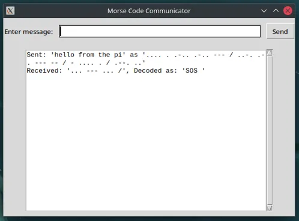

# Morse Code Communication Project
This project implements a bidirectional Morse code communication system using an Arduino board and a PC. The system allows users to send Morse encoded text messages to the Arduino using GUI Client, and send messages from the Arduino to the Client with a button connected to the Arduino.

## Components
1. Arduino Board (UNO R4 WiFi)
2. A PC with Python3 installed
3. Push button
4. LED
5. TFT Display (Adafruit ST7789)

## Pin Connections
- TFT Display:
    - CS: Pin 10
    - DC: Pin 9
    - RST: Pin 8
    - VCC: 5V
    - GND: GND
- LED: Pin 3
- Push Button: Pin 2 

## Arduino Sketch (`morse.ino`)
The Arduino sketch provides the following functionality:

### Sending Morse Code
- Users can input Morse code using a push button connected to the Arduino.
- Short presses (< 500ms) are interpreted as dots, while longer presses are interpreted as dashes.
- The LED lights up when the button is pressed, providing visual feedback.
- Proper spacing is added between letters and words based on the duration of pauses between button presses.

### Receiving and Displaying Messages
- The Arduino can receive Morse code messages from the PC client.
- Received messages are decoded and displayed on the TFT screen.
- The original Morse code and its decoded version are both shown on the display.
- The received Morse code is also blinked out on the LED.

### WiFi Connectivity
- The Arduino connects to a WiFi network for communication with the PC.
- It acts as both a client (when sending messages) and a server (when receiving messages).

### Message Formatting
- Morse code messages use spaces between letters and "/" between words.
- Example: "... --- ... / ... --- ..." represents "SOS SOS"

## PC Client (`client.py`)
The PC runs a Python script that provides a graphical user interface for the Morse code communication system.

### Features
- Allows users to input text messages through a GUI.
- Encodes text messages into Morse code.
- Sends encoded Morse code messages to the Arduino.
- Receives Morse code messages from the Arduino.
- Decodes received Morse code messages and displays both the Morse code and decoded text.

### User Interface
- Text entry field for composing messages.
- "Send" button to transmit messages to the Arduino.
- Scrollable text area displaying sent and received messages.

## Setup and Usage
1. Upload the `morse.ino` sketch to your Arduino board.
2. Ensure the Arduino is connected to the same WiFi network as the PC.
3. Run the `client.py` script on the PC.
4. Use the push button on the Arduino to send Morse code messages.
5. Use the GUI on the PC to send text messages (which will be converted to Morse code).
6. View received messages on both the Arduino's TFT display and the PC's GUI.

### Arduino Interface

### PC Client

## Dependencies
### Arduino
- WiFiS3 library
- Adafruit_GFX library
- Adafruit_ST7789 library

### PC
- Python 3
- tkinter
- socket
- threading
- dotenv

## Configuration
Ensure to set up the following:
- WiFi credentials in the Arduino sketch
- Correct IP addresses and ports in both the Arduino sketch and Python script
